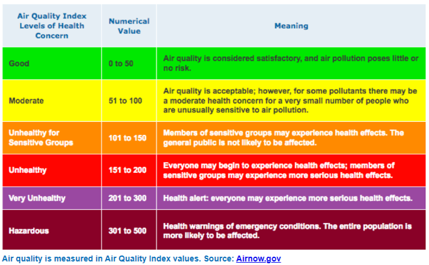

# The effect of greenspace on air quality: an analysis of Jefferson County, Kentucky

## Map Description

This map is created to produce a visual representation to support studies that indicate the presence of greenspaces have a postive influence on air quality of environments.
These studies, such as [Maas 2006](https://jech.bmj.com/content/60/7/587) state that greenspaces such as parks and dense tree canopy can benefit human health and the surrounding environment. The air quality of an environment is measured using the Air Quality Index (AQI) and determines how safe the air is for human health and is quantified on the scale below .

*AQI scale from https://scijinks.gov/air-quality/*

The map for this study focuses on the AQI based upon the ground-level ozone pollutants in Jefferson County, Kentucky. Ground-level ozone was chosen as the focal pollutant since the AQI is separated by pollutant, and ground-level ozone poses the greatest risk to human health out of the five major pollutants measured. The AQI for the ozone is then compared against the amount of greenspaces present nearby. 

Since there are many factors that can impact the AQI of a region, one more factor is considered in the scope of this study. Nonpoint source pollution through transportation is the largest contributor to raising AQI values to unhealthy conditions. Due to this, major roads and railroads are mapped and compared against the regions of mapped AQI to compare with the amount of greenspace within the monitoring areas.

## Data Used and Data Sources

Air Quality Data - Environmental Protection Agency website https://aqs.epa.gov/aqsweb/airdata/download_files.html#Annual

Greenspaces Data - Louisville/Jefferson County Information Consortium vis (hub.arcgis.com) 

    Recreation areas - (https://hub.arcgis.com/datasets/LOJIC::jefferson-county-ky-recreation-areas-2019-1/about)

    Louisville Metro Parks - https://hub.arcgis.com/datasets/LOJIC::louisville-ky-metro-parks-2/about

    Tree canopy - https://hub.arcgis.com/datasets/LOJIC::jefferson-county-ky-tree-canopy-areas-2019-1/about

    Natural areas - https://hub.arcgis.com/datasets/LOJIC::jefferson-county-ky-natural-areas-2/about

Transportation Data - Louisville/Jefferson County Information Consortium vis hub.arcgis.com

    Railroads - https://hub.arcgis.com/datasets/LOJIC::jefferson-county-ky-railroads-2022/about

    Major roads - https://hub.arcgis.com/datasets/LOJIC::louisville-metro-area-ky-major-roads/about